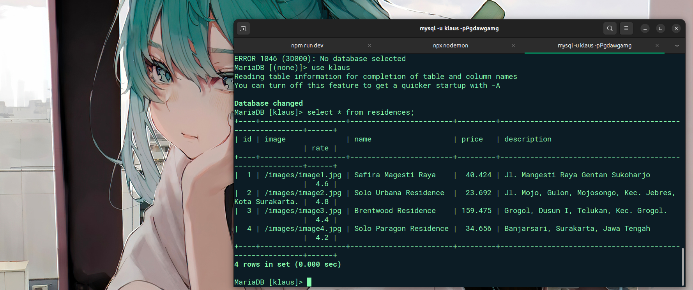

 
# 💫 About Me:
🌱 I’m currently learning Bun js   💬 Ask me about next js  , frame motion, tailwind css     How to reach me klausdev2@gmail.com 

# 💻 Tech Stack:
             
 

 

# 📊 GitHub Stats:

 

